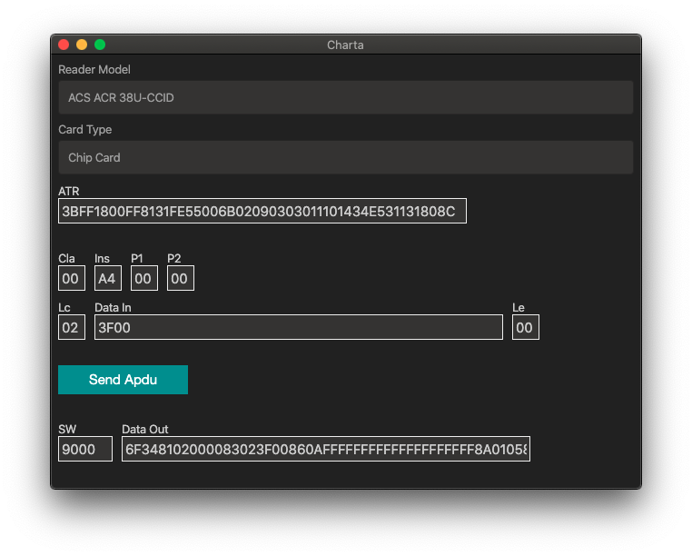

# Charta 💳
## Dev tool for smartcard/pos developers
### Charta is a cross platform app which helps developers/testers to interact with chip cards and send Apdus

Smartcards supported:
- ISO 7816 (e.g. emv cards, Italian CRS/CNS cards, etc)
- Memory Cards (cards actually supported are SLEXX28 & SLExx42 with ACR38 Reader)

